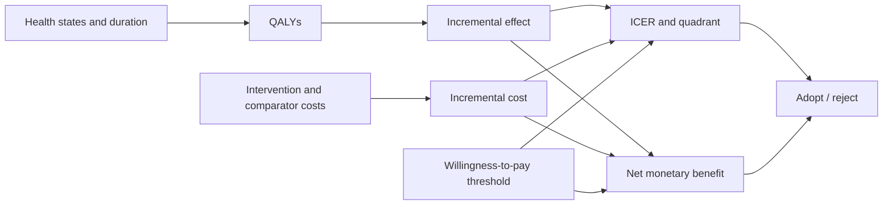
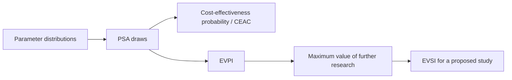

# Decision data flows

The modules are independent calculations; these diagrams show common ways to
compose them.

```mermaid
flowchart LR
    A[Health states and duration] --> B[QALYs]
    B --> C[Incremental effect]
    D[Intervention and comparator costs] --> E[Incremental cost]
    C --> F[ICER and quadrant]
    E --> F
    C --> G[Net monetary benefit]
    E --> G
    H[Willingness-to-pay threshold] --> F
    H --> G
    F --> I[Adopt / reject]
    G --> I
```

```mermaid
flowchart LR
    U[Parameter distributions] --> P[PSA draws]
    P --> C[Cost-effectiveness probability / CEAC]
    P --> V[EVPI]
    V --> S[Maximum value of further research]
    S --> E[EVSI for a proposed study]
```

```mermaid
flowchart LR
    T[Time released] --> O[Extra activity]
    O --> W[Waiting-list / throughput impact]
    W --> H[Health and operational value]
    H --> R[Cash-releasing vs capacity classification]
    R --> B[Business case and benefits realization]
```
